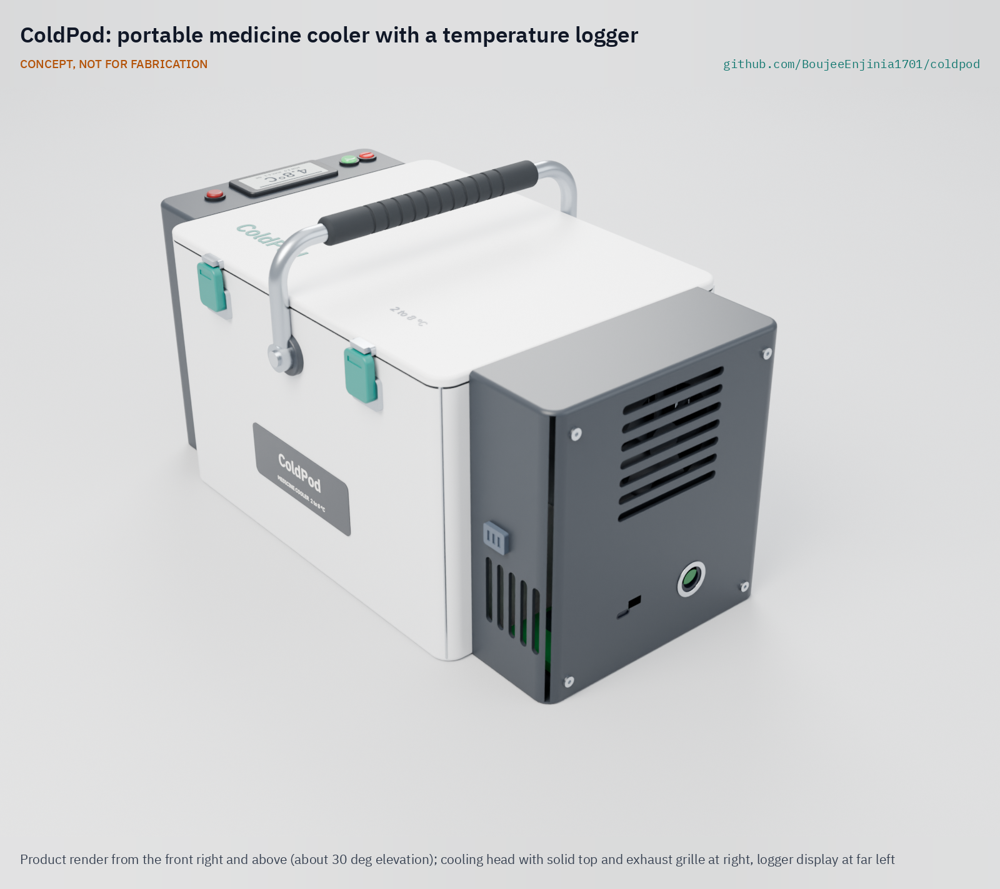

# ColdPod

     

**Area:** BioMedical · **TRL:** 3 of 9 (proof of concept on paper) · **Prototype budget:** $310 USD · **Difficulty:** 3 of 5

Portable Peltier cooler with a phase-change buffer and a temperature logger that raises alerts on excursions.

[Exploded render](media/render-exploded.png) · [Detail render](media/render-detail.png) · [Interactive 3D model](media/viewer.html) · [Concept blueprint (PDF)](media/concept-blueprint.pdf) · [General arrangement CPD-DWG-001 (PDF)](cad/drawings/CPD-DWG-001.pdf) · [Sizing calculations](docs/04-calcs/01-sizing.md) · [Review note](docs/REVIEW.md)

## Concept rationale

A vaccine or insulin carrier has to solve two problems at once: it must not let the load warm up, and it must not let it freeze. Ice packs solve the first badly and cause the second. ColdPod stores its cold in a phase-change material that melts at 5 °C, so the coldest thing next to the payload is still inside the 2 to 8 °C window. A small Peltier module recharges that store from a vehicle socket, a solar panel or a USB-C charger instead of a freezer, and a one-way thermosiphon stops the module from leaking heat back in when it is off. A logger with its own alarms records what the payload actually saw, so a health worker knows whether a load is still good.

It is open and garage-buildable because the gap is not the physics but access. Commercial active carriers exist, but they are closed products that a clinic, a university group or a maker space cannot inspect, repair or adapt. ColdPod uses printed parts, bought vacuum-insulated panels, off-the-shelf power modules and no custom circuit board, and it publishes its heat-leak, hold-time and fault calculations so that anyone can check them.

## Burning platform

Two very large groups depend on a cold chain that often fails at its last step. There are 589 million adults living with diabetes, 81 % of them in low- and middle-income countries ([IDF Diabetes Atlas, 11th edition, 2025](https://media.idf.org/media/uploads/sites/3/2025/04/IDF_Atlas_11th_Edition_2025_Global-Factsheet.pdf)), and many of those who use insulin must keep it at 2 to 8 °C and discard it if it freezes ([US FDA](https://www.fda.gov/drugs/emergency-preparedness-drugs/information-regarding-insulin-storage-and-switching-between-products-emergency)). Routine immunization still leaves 14.3 million infants a year without a single vaccine dose, half of them in countries affected by fragility, conflict or humanitarian crises, where carrying vaccines is hardest ([WHO and UNICEF, 2025](https://www.unicef.org/press-releases/global-childhood-vaccination-holds-steady-yet-over-14-million-infants-remain)).

Freezing, not only heat, is a common failure. A systematic review estimated that vaccines were exposed to temperatures below the recommended range in about 33 % of storage in wealthier countries and 37 % in lower-income countries, and in about 38 % and 19 % of shipments ([Hanson et al., *Vaccine*, 2017](https://www.sciencedirect.com/science/article/pii/S0264410X16309471)). Many of these events are never recorded, because the carrier has no logger.

## Where it could be used

### By industry

| Industry | Use |
| --- | --- |
| Public health and immunization programs | Outreach sessions on foot, bicycle or motorbike, with a record that the day's vaccines stayed in range |
| Humanitarian and disaster response | Insulin and vaccines carried where the grid is down, recharged from vehicles or solar panels |
| Community pharmacy and home delivery | Temperature-sensitive medicines delivered by van or motorbike with a trip log |
| Diabetes care and patient support | Travel and power-cut backup for people who carry a month of insulin |
| Clinical research and sample logistics | Short transfers of 2 to 8 °C research materials with a logged temperature history |
| Global health engineering education | An open, auditable reference design for cold chain teaching and research |

### By country or region

| Country or region | Why it matters there |
| --- | --- |
| Sub-Saharan Africa | Long outreach trips in heat with intermittent clinic power; WHO measures a vaccine carrier's cold life at a constant ambient temperature of 43 °C ([WHO PQS E004/VC01.2](https://extranet.who.int/pqweb/key-resources/documents/pqs-performance-specification-e004vc012-vaccine-carrier)) |
| South Asia | Very hot pre-monsoon seasons and dense rural outreach; the region is part of the low- and middle-income world where 81 % of adults with diabetes live ([IDF, 2025](https://media.idf.org/media/uploads/sites/3/2025/04/IDF_Atlas_11th_Edition_2025_Global-Factsheet.pdf)) |
| Countries affected by conflict or humanitarian crisis | Half of all unvaccinated children live in 26 fragile or crisis-affected countries ([WHO and UNICEF, 2025](https://www.unicef.org/press-releases/global-childhood-vaccination-holds-steady-yet-over-14-million-infants-remain)), where cold chain equipment and power are least reliable |
| Latin America, including the Amazon basin | In Colombia's Putumayo department, vaccination teams travel five to six hours by river to reach riverside communities ([PAHO, 2024](https://www.paho.org/en/stories/colombian-vaccination-team-donated-boat-makes-all-difference)), and in Panama some communities can be reached only by plane or boat ([PAHO](https://www.paho.org/en/stories/strengthening-cold-chain-operations-mission-take-vaccines-farthest-corners-region)) |
| United States and other high-income countries | Natural disasters and other emergencies can leave people with insulin but no working refrigerator; the FDA publishes storage guidance for these conditions ([US FDA](https://www.fda.gov/drugs/emergency-preparedness-drugs/information-regarding-insulin-storage-and-switching-between-products-emergency)), and freezing in storage is common even in wealthier countries ([Hanson et al., 2017](https://www.sciencedirect.com/science/article/pii/S0264410X16309471)) |

## What sparked the idea

The starting point was the vaccine vial monitor, the heat-sensitive label that WHO and PATH brought into use on oral polio vaccine in 1996 ([PATH](https://www.path.org/our-impact/articles/vaccine-vial-monitor-worlds-smartest-sticker/)). It showed that a cheap indicator travelling with each vial could change field practice, but it records only cumulative heat: training material for health workers states that vial monitors "do not measure exposure to freezing temperatures" and that a frozen vaccine may have lost its potency without the monitor showing it ([OpenLearn Create, Immunization module](https://www.open.edu/openlearncreate/mod/oucontent/view.php?id=53354&section=1.5.1)). ColdPod takes the next step for the carrier itself: prevent freezing by design, and log and alarm on both heat and cold.

## Problem

Insulin and vaccines spoil in field transport without a reliable cold chain. They must stay between 2 and 8 °C: ice packs run out in the heat, freeze vials when they are too cold, and usually nothing records what happened. Studies of the vaccine cold chain find freezing exposure in roughly a fifth to a third of storage and shipping studies. Design with, not for: requirements must come from co-design with health workers and people who carry insulin, through a local partner.

Full problem statement: [docs/01-problem.md](docs/01-problem.md)

## Concept

A carry case 366 x 212 x 207 mm holds 1.36 L of insulin or vaccines (24 insulin pens) in an aluminium liner wrapped in a phase-change material that melts at 5 °C, inside 25 mm vacuum-insulated panels. A Peltier module refreezes the phase-change material from a 12 V socket, a solar panel or a USB-C charger, through a loop thermosiphon that carries heat one way only; an aluminium cold plate under the lid pack lets it freeze that pack too. A 76.8 Wh LiFePO4 battery keeps it cooling on the road, and a logger records the payload temperature every minute and raises alarms on excursions.

TRL 3 calculations ([CPD-CAL-001](docs/04-calcs/01-sizing.md)): about 14.0 h with no power at 43 °C, 28.4 h off-grid at 32 °C and 17.5 h off-grid at 43 °C, all with thin margins. Two hardware cut-outs in series keep a stuck-on driver from freezing the payload. Two targets are missed by small margins: refreezing all the phase-change material takes 8.4 h (target 8 h) and the case weighs 5.53 kg empty (target 5.5 kg); the options are awaiting Amish. The parts cost $303 against the $310 budget. TRL 4 (lab testing) is on hold.

Full design precis: [docs/02-concept.md](docs/02-concept.md)

## Key components

- Vacuum-insulated panels, 25 mm, in a printed shell
- Phase-change material packs, 5 °C, around an aluminium liner
- Aluminium evaporator can and loop thermosiphon (one-way) to a 40 mm Peltier module (TEC1-12703 class)
- Aluminium lid cold plate under the lid phase-change pack
- Heat sink and fan in a vented cooling head
- LiFePO4 battery, 12.8 V 6 Ah (76.8 Wh), with BMS
- USB-C PD and 12 V power board with a buck-boost Peltier driver and two hardware freeze cut-outs (cold block and liner)
- nRF52840 logger with buffered payload probe, e-paper display and alarm

The working bill of materials is in [bom/bom.csv](bom/bom.csv).

## Safety

> This is a research and educational prototype. It is not a medical device, has not been cleared or approved by any regulator, is not WHO-prequalified, and must not be used to diagnose, treat or monitor any person or as the only protection for real vaccines or insulin.

It contains a lithium (LiFePO4) battery, a combustible paraffin phase-change material and a heat sink that can get hot. See the safety section of the [design precis](docs/02-concept.md#safety).

## Repository layout

| Folder | Contents |
| --- | --- |
| `docs/` | Problem, concept, requirements, calculations (`04-calcs/`) and design decisions (`decisions/`) |
| `cad/src/` | build123d Python source, the source of truth for all geometry |
| `cad/step/`, `cad/stl/` | Exported models for FreeCAD, other CAD tools and printing |
| `cad/drawings/` | 2D sketches and dimensioned drawings |
| `bom/` | Bill of materials |
| `electronics/` | KiCad schematics and PCB layouts |
| `firmware/` | Microcontroller code |
| `media/` | Renders, perspectives and photos |
| `build-log/` | Dated prototyping notes |

## Documentation

Controlled documents follow the portfolio [documentation standard](.kit/STANDARDS.md). Each carries a document ID (CPD-PRC-001 for the precis), a version and a revision history. Branded PDFs are built with `python .kit/render.py` and attached to GitHub Releases when a document is tagged, for example `CPD-PRC-001/v1.0`.

## Credits

Designed by Amish Chadha. See [CONTRIBUTORS.md](CONTRIBUTORS.md) for roles. To cite this design, use [CITATION.cff](CITATION.cff) (GitHub shows it as "Cite this repository").

AI assistance (Claude) was used to accelerate concept renders, prototype documentation and first-pass sizing calculations. Design direction and all decisions are Amish Chadha's, recorded in this repository's decision records (`docs/decisions/`).

## Licenses

- **Hardware** (CAD, drawings, BOM, electronics): [CERN-OHL-S v2](LICENSE)
- **Software** (firmware, scripts, notebooks): [MIT](LICENSE-SOFTWARE)

A project of the [Design Molecule](https://designmolecule.com) lab.
