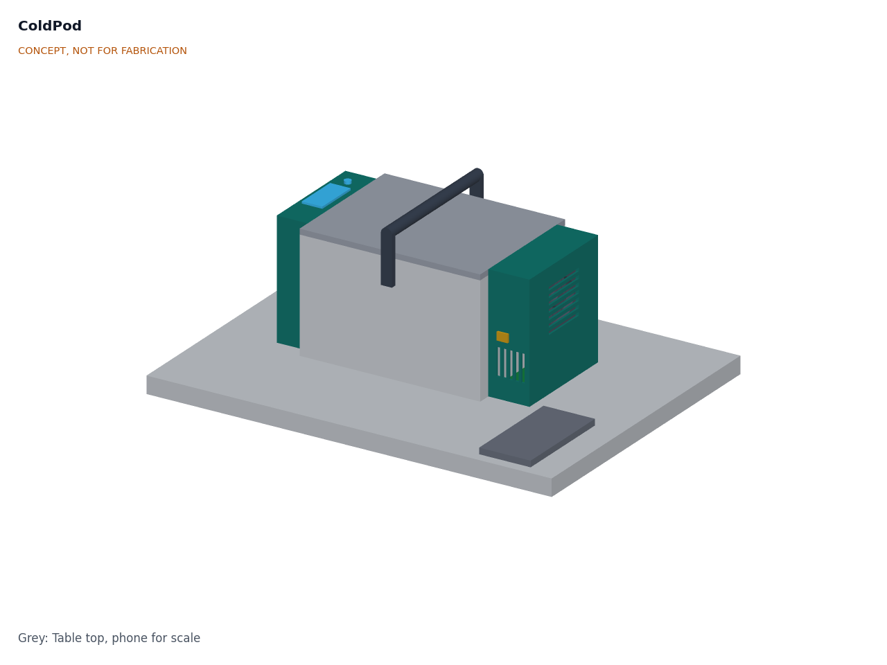
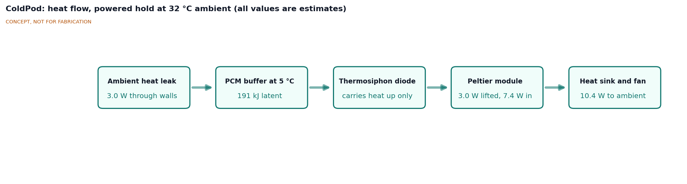
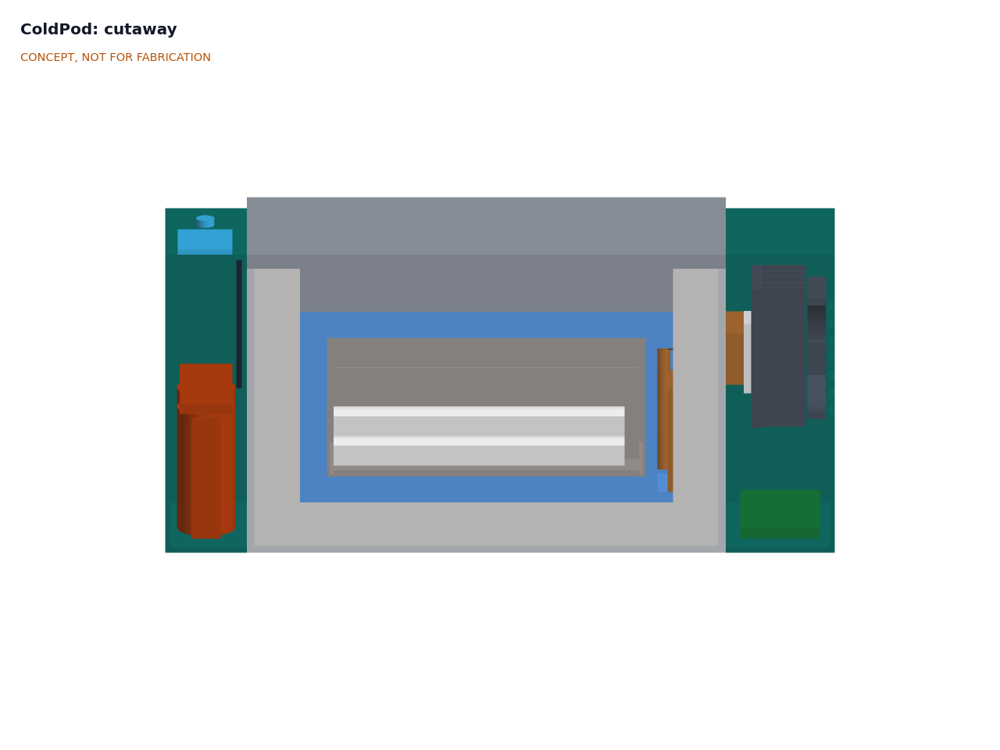
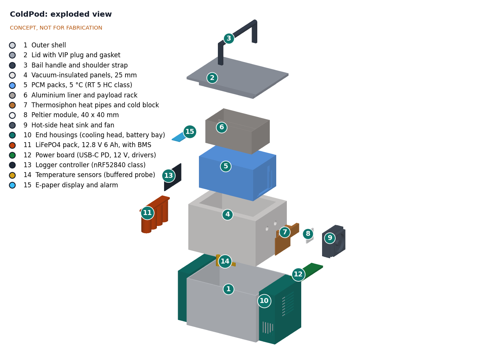

# ColdPod design precis

ColdPod is a carry case about the size of a lunch cooler (about 370 x 215 x 205 mm) that holds 1.2 L of insulin or vaccines at 2 to 8 °C. The payload sits in an aluminium liner wrapped in a phase-change material (PCM) that melts at 5 °C, inside 25 mm vacuum-insulated panels. A Peltier module freezes the PCM from a 12 V socket, a solar panel or a USB-C charger, and a small LiFePO4 battery keeps it running on the road. A gravity thermosiphon connects the two and carries heat in one direction only, so a stopped Peltier does not leak heat back in. A logger records the payload temperature every minute and raises alarms. First-order numbers suggest about 13 h with no power at 43 °C, about 26 h off-grid at 32 °C and about 16 h off-grid at 43 °C, for about $280 in parts and 5.2 kg empty. The last three figures miss their targets (R6, R15 and R12).

*Figure 1. ColdPod on a table, with a phone for scale. Cooling head on the right end, battery and electronics bay with the e-paper display on the left end. Massing model.*

## How it works

1. **Charge the cold.** At a clinic, in a vehicle or under a solar panel, the Peltier module runs at up to about 30 W and freezes the PCM through the thermosiphon. The same input charges the battery. A melted PCM refreezes in about 5 h; the case works best if the payload goes in already cold from a refrigerator.
2. **Carry.** On the road, the controller runs the Peltier from the battery only as hard as needed to hold the PCM frozen, and turns it off when the battery reaches 15 % so that the logger always has a reserve.
3. **Hold passively.** When the battery is flat or the user switches cooling off, the PCM absorbs the heat that leaks through the walls. Because it melts at 5 °C, it cannot pull the payload below freezing the way water ice can.
4. **Watch.** A buffered probe among the payload, a liner probe, a cold-block probe and an ambient sensor are read every minute. The payload probe is logged with a timestamp on the controller's flash memory for 60 days or more.
5. **Alarm.** The display shows current, minimum and maximum temperature and time left. A buzzer, an LED and a phone notification warn after 10 min outside 2 to 8 °C, alarm at once at 0 °C or lower, and flag low battery, a failed sensor or a lid left open. The owner exports the log as a CSV file over Bluetooth Low Energy or USB. Nothing goes to the cloud.

*Figure 2. Heat flow in powered hold at 32 °C ambient. All values are estimates: 0.11 W/K overall heat leak, Peltier coefficient of performance (COP) 0.4, fan 0.6 W.*

## Main components

Table 1. Main components. Numbers match `bom/bom.csv` and Figure 4.

| # | Component | Proposed choice | Notes |
| --- | --- | --- | --- |
| 1 | Outer shell | 3D-printed PETG or ASA tub, 4 mm walls, 263 x 198 x 164 mm | Protects the VIPs from knocks and punctures |
| 2 | Lid | Printed cap with EPDM gasket and a 25 mm VIP plug | Latches closed; lid switch for the lid-open alarm |
| 3 | Bail handle and strap | Folding bail handle, padded shoulder strap | Rated 10 kg or more |
| 4 | Vacuum-insulated panels | Six panels, 25 mm, fumed silica core, ordered to size | VIPs cannot be cut or pierced; the heat-pipe crossing is a foam-filled gap between panels |
| 5 | PCM packs | About 1.06 kg of organic PCM melting at 5 °C (Rubitherm RT 5 HC class) in sealed HDPE pouches: a jacket on four sides and the floor, and one pack under the lid | Organic paraffins are stable for thousands of cycles ([PATH PCM study](https://media.path.org/documents/DT_pcm_summary_rpt1.pdf)) |
| 6 | Liner and rack | 1.5 mm aluminium can, 175 x 110 x 80 mm inside, with a removable rack | Spreads cold evenly around the payload |
| 7 | Thermosiphon | Two short heat pipes with a stainless adiabatic section, evaporator plate on the outer face of the PCM, copper cold block above it | One-way thermal link (design choice 2) |
| 8 | Peltier module | 40 x 40 mm, 12 V class (TEC1-12706 or a lower-current variant) | Driven by pulse-width modulation (PWM) at part load for better COP |
| 9 | Heat sink and fan | Finned aluminium sink with a 70 mm, 12 V fan and a finger guard | Rejects about 10 W at 32 °C and about 21 W at 43 °C |
| 10 | End housings | Printed cooling head (+X end) and battery and electronics bay (−X end), vented | Keep the heat source and the battery outside the insulation |
| 11 | Battery | LiFePO4, 4S1P 32700 cells, 12.8 V 6 Ah (76.8 Wh), BMS and fuse | Below the 100 Wh airline limit |
| 12 | Power board | USB-C PD sink (20 V), 12 V input with reverse-polarity protection, LiFePO4 charger, Peltier and fan drivers, hardware over-cold cut-out | Off-the-shelf modules on a carrier board |
| 13 | Logger controller | nRF52840 module with real-time clock and 2 MB flash | Bluetooth Low Energy link to a phone |
| 14 | Temperature sensors | Glycol-buffered payload probe, liner probe, cold-block probe, ambient sensor | Digital sensors with ±0.5 °C or better accuracy |
| 15 | Display and alarm | 2.13 in e-paper, buzzer, red and green LED | E-paper keeps the last reading visible with no power |

Item 16 (wiring, fasteners, latches and consumables) is in the BOM but not modelled.

*Figure 3. Section looking from the front. From the inside out: payload (white pens) in the rack and liner (6), PCM (5, blue), VIPs (4, light grey) and shell (1). The thermosiphon riser (7) runs up the right side of the PCM to the cold block, Peltier (8) and heat sink (9) in the cooling head. The battery (11) and logger (13) are in the left bay.*

## First-order numbers

All values are estimates for concept review and will be checked at TRL 3. Assumptions:

- **Heat leak.** Aged VIP centre-of-panel conductivity 0.007 W/(m·K), inside the 0.006 to 0.008 W/(m·K) range usually quoted ([Wikipedia, vacuum insulated panel](https://en.wikipedia.org/wiki/Vacuum_insulated_panel)), multiplied by 1.8 for panel edges, joints and the foam-filled crossing. Mean panel area 0.179 m² at 25 mm gives 0.090 W/K. Adding the lid gasket (0.010 W/K), the thermosiphon's stainless adiabatic section (0.006 W/K) and sensor wires (0.002 W/K) gives an overall conductance of about **0.11 W/K**, uncertain by perhaps ±30 %.
- **PCM.** 1.62 L of space, 85 % filled, density 0.77 kg/L, gives 1.06 kg. Rubitherm lists 250 kJ/kg for RT 5 HC over its stated range ([Rubitherm RT range](https://www.rubitherm.eu/en/productcategory/organische-pcm-rt)); only about 180 kJ/kg is assumed usable inside the 2 to 8 °C window, giving about **191 kJ (53 Wh)** of cold.
- **Peltier.** Single-stage modules typically reach a COP of 0.3 to 0.7 ([ThermalLM](https://thermallm.com/cop-of-a-thermoelectric-cooler-tec/)). Assumed 0.55 at 25 °C, 0.40 at 32 °C and 0.25 at 43 °C ambient, with the cold block near 0 °C and the hot side 8 to 10 K above ambient.
- **Battery.** 76.8 Wh nominal; 85 % available to cooling (65 Wh), the rest kept for the logger and cell life. Fan 0.6 W, controller 0.1 W.

Table 2. Hold times, charging, size, mass and cost.

| Quantity | Estimate | Basis | Requirement |
| --- | --- | --- | --- |
| Payload | about 1.2 L; about 24 insulin pens in two layers | 175 x 110 x 80 mm inside the liner, less the rack | R3 met |
| Heat leak | 2.2 W at 25 °C, 3.0 W at 32 °C, 4.2 W at 43 °C | 0.11 W/K, payload at 5 °C | |
| Passive hold, PCM only | about 24 h at 25 °C, 18 h at 32 °C, **12.7 h at 43 °C** | 191 kJ / heat leak | R4 met, thin margin |
| Electrical power to hold | 4.7 W at 25 °C, 8.1 W at 32 °C, 17.4 W at 43 °C | Heat leak / COP, plus fan and controller | R7 met on estimate |
| Battery hold, then PCM | about 14 + 24 = 38 h at 25 °C; 8 + 18 = **26 h at 32 °C**; 3.7 + 12.7 = **16 h at 43 °C** | 65 Wh / electrical power, then the PCM | R5 met, thin; R6 **not met** |
| PCM refreeze from melted | about 4.7 h latent; about 6 h from a warm, empty box at 25 °C | 30 W to the Peltier, COP 0.45, 13.5 W lifted less 2.2 W leak | R8 met |
| Pulling down a warm payload | about 3.7 h extra for 1.2 kg loaded at 25 °C | 149 kJ sensible heat at 11 W net | Load payload pre-cooled |
| Battery recharge | about 3 h from a 60 W USB-C PD charger | 25 W to the battery while the Peltier runs at 30 W | |
| Heat rejected at the heat sink | about 6 W at 25 °C, 10 W at 32 °C, 21 W at 43 °C | Heat lifted plus Peltier input | Fan needed |
| Logger reserve | weeks | 15 % of 76.8 Wh (11.5 Wh) at about 5 mW average | R11 met |
| Log storage | about 1.4 MB for 60 days | 1 record per minute, 16 bytes | R9 met on 2 MB flash |
| Size | about 370 x 215 x 205 mm (14.6 x 8.5 x 8.1 in) overall | 263 mm body, 45 mm bay, 60 mm cooling head; handle folded up | R13 met |
| Mass, empty | about **5.2 kg (11.5 lb)** | Shell 0.65, lid 0.28, handle and strap 0.20, VIPs 0.83, PCM and pouches 1.16, liner and rack 0.33, thermosiphon 0.20, Peltier 0.03, heat sink and fan 0.30, housings 0.30, battery 0.65, electronics 0.15, wiring and hardware 0.15 kg | R12 **not met** (5.0 kg) |
| Parts cost | about **$280** | Indicative prices, see `bom/bom.csv` | R15 **not met** ($250) |

## Key design choices

All are proposed, awaiting Amish.

1. **PCM at 5 °C instead of water ice.** Water ice stores about 334 kJ/kg, nearly twice as much, but a frozen ice pack sits at 0 °C or below and is a known cause of vaccine freezing ([Hanson et al., 2017](https://www.sciencedirect.com/science/article/pii/S0264410X16309471)). A 5 °C PCM keeps the whole payload space inside the window. Options: (a) 5 °C organic PCM; (b) water with a conditioning step; (c) a 3 °C PCM for a little more margin against heat. Recommendation: (a).
2. **A thermosiphon between the Peltier and the PCM.** A Peltier module that is switched off conducts heat well: an estimated 0.3 to 0.5 W/K for a 40 mm module, three to five times the whole box's heat leak. Bolted straight to the liner, it would melt the PCM in a few hours when the battery runs out. A gravity thermosiphon, with its cold end above its warm end, only carries heat upward and out, so it acts as a thermal diode. Options: (a) thermosiphon; (b) a mechanical disconnect that lifts the cold block away when power is lost; (c) direct mounting and accept the loss. Recommendation: (a), with (b) as the fallback if the thermosiphon cannot be sourced or made reliably at this size.
3. **Evaporator plate on the outer face of the PCM, not on the liner.** Keeps the coldest surface (about 0 °C during refreezing) separated from the payload by the PCM, which supports R2. Recommendation: as drawn.
4. **LiFePO4, 76.8 Wh.** LiFePO4 tolerates heat better than other lithium-ion chemistries and 76.8 Wh stays under the 100 Wh airline limit. Options: (a) 4S1P, 76.8 Wh, $35; (b) 4S2P, 153.6 Wh, about $30 more and 0.6 kg heavier, airline approval needed; it raises the 43 °C off-grid hold to about 20 h, still short of R6. Recommendation: (a).
5. **R6 shortfall.** Options: (a) accept about 16 h at 43 °C off-grid and tell users to run from a vehicle 12 V socket or a solar panel on long hot trips; (b) the larger battery in choice 4 (about 20 h); (c) 35 mm VIPs and about 1.6 kg of PCM, which is also needed to reach 24 h, making the box about 400 mm long and over 6 kg. Recommendation: (a), and revisit after field data on real trip temperatures.
6. **Vacuum-insulated panels instead of foam.** Polyurethane foam of the same thickness (about 0.024 W/(m·K)) lets through about twice as much heat once VIP edge losses are counted, so the passive hold at 43 °C would drop from about 13 h to about 7 h, but it would save about $45 and some mass. Recommendation: VIPs, with a foam version documented as a low-cost variant.
7. **Local alarms and Bluetooth Low Energy only.** No cellular or LoRa radio in the first build (either would add $20 to $40 and more power). Recommendation: Bluetooth Low Energy first.
8. **Alarm thresholds.** Proposed defaults: warn after 10 min outside 2 to 8 °C; alarm at once at 0 °C or lower on the payload probe; alarm if the liner probe reaches 1 °C (an early freeze warning). Recommendation: these defaults, adjustable per product.
9. **Budget.** Parts cost about $280, about $30 over the $250 budget in `project.yaml`. Options: (a) raise the budget to $300; (b) keep $250 and use foam instead of VIPs (choice 6); (c) keep $250 and use a smaller 0.8 L liner. Recommendation: (a). `project.yaml` is unchanged.

*Figure 4. Exploded view with BOM numbers. The payload pens rise with the liner (6).*

## Safety

> **Safety:** ColdPod is a research and educational prototype. It is not a medical device, is not WHO-prequalified and has not been cleared or approved by any regulator. Do not use it as the only protection for vaccines, insulin or other medicines. Follow national immunization program and manufacturer storage instructions, and use a qualified carrier and a calibrated logger for real products.

> **Safety:** The LiFePO4 pack stores 76.8 Wh. Use it only with its BMS and fuse, charge it only between 0 and 45 °C (the controller must block charging outside that range), and never charge a damaged, swollen or wet pack. The battery sits in its own vented bay outside the insulation, away from the Peltier's hot side.

> **Safety:** The PCM is a paraffin, which is combustible. It stays sealed in HDPE pouches, separated from the battery bay by the VIPs and the shell. Replace any leaking pouch; paraffin can also soften some plastics ([PATH PCM study](https://media.path.org/documents/DT_pcm_summary_rpt1.pdf)).

- **Hot surfaces.** At 43 °C ambient the heat sink may reach about 55 to 65 °C (estimate). It is enclosed by the vented cooling head, and the vents must not be blocked, covered or placed against skin or a bag.
- **Moving parts.** The fan has a finger guard inside the cooling head grille.
- **Electrical.** All voltages are 20 V DC or less. There are no mains-voltage parts in the box. Inputs are fused and protected against reverse polarity.
- **Freezing fault.** A stuck-on Peltier driver is the main way to freeze the payload. A hardware thermostat on the cold block cuts power to the Peltier below −5 °C, independent of the firmware, and the liner and payload probes raise alarms.
- **Condensation.** Water condenses on the cold block and pipes. The cooling head drains outward and the electronics are conformal-coated.
- **VIP damage.** A punctured VIP loses most of its insulation value without any visible change. The shell protects the panels, and a rising Peltier duty cycle should trigger a service warning.
- **Lifting.** About 6.4 kg when loaded; carry with the strap across the body.

## Open questions for TRL 3

- Can a small thermosiphon work reliably when the case is tilted during a motorbike ride, and at what tilt does it stop working? If not, a mechanical disconnect (choice 2b) is needed.
- Confirm the off-state thermal conductance of the chosen Peltier module and the real COP at part load with the chosen heat sink.
- Confirm the VIP supplier, panel sizes, aged conductivity and edge losses; the heat-leak estimate drives every hold time.
- Confirm the usable latent heat of the PCM between 2 and 8 °C, its supercooling and its behavior over many cycles.
- Where to place the payload probe so that it represents the warmest vial, not the average.
- R6, R12 and R15 are missed (see choices 5 and 9, and the mass table). Which of them should be relaxed, and which should drive a redesign?
- Validate trip profiles, loads, alarm behavior and price with users through a partner.

Concept media: [blueprint sheet](../media/concept-blueprint.pdf), [interactive 3D model](../media/viewer.html).
